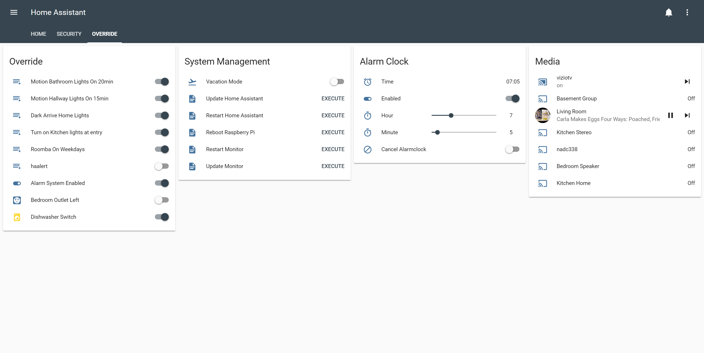

# Home Assistant
My personal implantation of [Home Assistant](https://home-assistant.io) (version: 0.60.1)

## Overview

Here is my home automation project Ive been improving on since mid 2017. At that time I had switched from Samsung SmartThings and I could not be more happy with my decision. I take a firm minimalism approach to my layout, hence why the number of things are essential and concise. Also, some areas and ideas of improvement have been limited due to leasing my dwelling but that situation will be changing soon.

### In-front of Home Assistant
* HA is running in a Virtual Environment on Raspberry Pi 3 running Debian Stretch. I tried Hassbian and other deployment methods but wasn't satisfied with the level of control for the things I list below until I put HA on top of my own deployed OS. 
* To connect to HA externally I use my own domain through Google Domains with a Dynamic DNS record setup on a sub domain. To solve the internal/external connecting problem I have a Host Override setup on my pfSense router that forwards my HA sub domain to the local IP address of HA when I'm on my local network.
* To secure HA I have an Nginx reverse proxy setup on the RaspberryPi that forwards requests to HA. In my Nginx config I have a certificate setup through [Let's Encrypt](https://letsencrypt.org/)
 that auto-renews to secure my traffic internally and externally.

### Big Components and Ideas
* Hide media devices when not in-use - This one was original, can be found in [mediaother.yaml](haconfig/packages/mediaother.yaml)
* Alarm Clock - I have lights slowly turn on and radio start playing instead of an immediate audible alarm. There are a few examples out there in google of alarm clocks.
* Google Assistant - I'm using the Google Assistant native integration to control lights and switches. For everything else and custom commands I am using the IFTTT integration with HA and Google Assistant, [guide here](https://community.home-assistant.io/t/how-to-integrate-google-assistant-and-home-assistant-api-using-only-ifttt/19269).
* Brightness slider below light switch - This provides the functionality to put the dimming slider on the main part of a switch. [state-card-custom-ui](https://github.com/andrey-git/home-assistant-custom-ui)
* Remote custom icon layout - This is how I front end my media and other devices with buttons. Was waiting for a while for a way to do this kind of custom UI for remotes. [state-card-tiles](https://github.com/maattdiy/home-assistant-config)
* Roomba 650 IR control - My Roomba doesn't have Wifi so I use my IR blaster to auto mate the schedule and starting. [Originated here](https://community.home-assistant.io/t/irobot-roomba/6288/9)
* Vizio TV API - There is a native component for Vizio TVs but I had issues with it early on and switched to shell commands. [Can be found here](https://community.home-assistant.io/t/vizio-smartcast/14987)
* [geekofweek](https://github.com/geekofweek/homeassistant) - When I was getting started I pulled ideas and config examples from this repo. Props to this guy.

### Future Considerations
* I would like to be able to click button start casting a Spotify playlist. Spotify currently doesn't support this functionality and do a voice command through Google Assistant.
* Use a consumption meeter Z-Wave outlet to assume states of devices. Being able to monitor the power draw of a device you can assume its state. For non smart devices, Roomba dock, dishwasher, laundry washer & drier.
* When I own a residence id like to monitor and operate deadbolts/doors and a garage door opener from HA.
* Getting rid of Hue things for full Z-Wave consistency.

## Devices
* Raspberry Pi 3
* Aeotec Z-Stick Gen5
* Pfsense router
* Asus Router (Set in AP mode) - 2

### Z-Wave Devices
* GE Z-Wave Plus In-wall Smart Dimmer Toggle 14295 - 6
* Ecolink Z-wave Plus Motion Detector PIRZWAVE2.5-ECO - 5
* Inovelli Z-Wave Plus Single Channel Smart Outlet
* Inovelli Z-Wave Plus Dual Channel Smart Outlet - 2
* Sensative Z-Wave Plus Strips Guard Contact Sensor (Don't recommend) - 3

### Controlled Devices
* Vizio 4k TV (Controlled through API)
* Nad Stereo (Controlled by Broadlink IR Blaster)
* Roomba 650 (Started by Broadlink IR Blaster)

### Media Devices
* Google Home
* Google Mini
* Chromecast Audio
* Chromecast Ultra
* Vizio Crave 360 (Chromecast built-in)
* Broadlink RM Mini Networked IR Blaster
* Hikvision Cameras - 2

### Deprecating
* Hue Bridge
* Hue White A19 - 2
* Hue Dimmer Switch

## Interface

